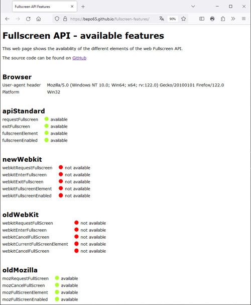

# fullscreen-features

Web page to show available fullscreen api features for your browser.

[]

## About The Project

This project consists of a web page that shows the availability of the different elements of the web Fullscreen API.

The page can also be used [live](https://bepo65.github.io/fullscreen-features/).

## License

Distributed under the MIT License. See `LICENSE` for more information.
